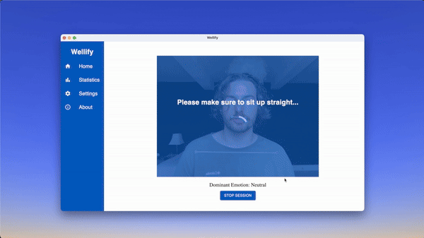

# Wellify

**Wellify** is a cross-platform desktop application designed to promote healthy work habits through posture tracking and work habit analysis. Built with Electron, React, and TypeScript, it leverages advanced machine learning models to monitor postural changes and provides real-time alerts to users. In addition to posture tracking, Wellify integrates emotion recognition via Morphcast to offer insights into users' emotions throughout their work sessions. This unique combination of features aims to enhance the overall well-being and productivity of its users.

## Features

- **Posture Tracking**: Utilizes machine learning models to monitor and analyze users' posture in real time.
- **Emotion Insights**: Integrates with Morphcast to track and plot emotions against user activity, offering a new layer of self-awareness during work sessions.
- **Activity Metrics**: Provides detailed metrics on user activity, such as the number of slouches detected per session, to encourage healthier work habits.
- **Cross-Platform Support**: Available for Linux, macOS, and Windows, ensuring accessibility for all users.
- **Real-Time Alerts**: Sends notifications to the user to correct unhealthy postures or work habits as they are detected.
- **Session Analytics**: Generates reports on each work session, allowing users to track their progress over time.

## Future Development

Currently Wellify is in the final stage of development. Motion and Emotion tracking with alerts is fully functional in the dev environment but we want to provide a full build available for download. Additioanlly we want to finalise the database integration so that users can have personalised metrics available to them (currently the statistics page uses faker.js for demo purposes). 

## Demo

## Showcase Video
Watch our showcase on youtube [Wellify Showcase](https://youtu.be/TR9Lf3g4rKk)

## Installation Instructions

To get started with Wellify, follow these steps:

**Cloning the repository:** `git clone https://github.com/wellify/wellify.git`

**Installing Dependencies:** `npm install`

**Run in Dev:** `npm run dev`

**Permissions** The app will require access to your camera (for motion and emotion tracking) as well as your activity (for activity tracking)

## System Requirements

- **Node.js**: Version 16.0.0 or higher.

## Packages

- **MediaPipe Pose:** Provides the motion tracking used for posture calculations.
- **MorphCast:** Provides the emotion tracking capabilities.
- **Electron:** Allows the creation of cross-platform desktop applications using web technologies.
- **React:** A frontend framework that enables the dynamic rendering of components based on state and props.
- **MySQL2:** Allows the interaction with the database in TypeScript.
- **Typescript, ESLint, & Prettier:** Used to ensure consistent, high-quality code and reduce errors.

## Contributing

Wellify is currently not open for direct contributions, but we welcome suggestions for improvements and additional features. Feel free to fork the project and explore its capabilities!

## Authors and Acknowledgments

Wellify was created by [@crdavidson1](https://github.com/crdavidson1), [@xiamonder](https://github.com/xiamonder), [@mrrobbob](https://github.com/mrrobbob), [@nutmegvant](https://github.com/nutmegvant), & [@ginnytruong](https://github.com/ginnytruong) as an innovative solution to promote healthy work habits.

This project was created as part of the Northcoders Software Development bootcamp. All of the tutors were incredibly helpful in the learning journey and their feedback whilst building this project was invaluable.

A special thanks to the team at MorphCast who kindly granted us an educational licesne to their fantastic API.

## Support

For questions, issues, or assistance with Wellify, please open an issue on the GitHub repository.